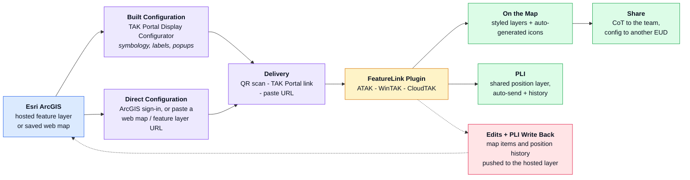

# FeatureLink Suite - Detailed Flow

Detailed version of the "How It All Fits Together" diagram. The root
[README.md](../README.md) carries a trimmed-down variant; this is the full one,
kept here for reuse in slides, docs, or other repos.

*Esri holds the data - a config says how it should look - the plugin puts it on
the EUD - edits and PLI flow back to the same layer.*
